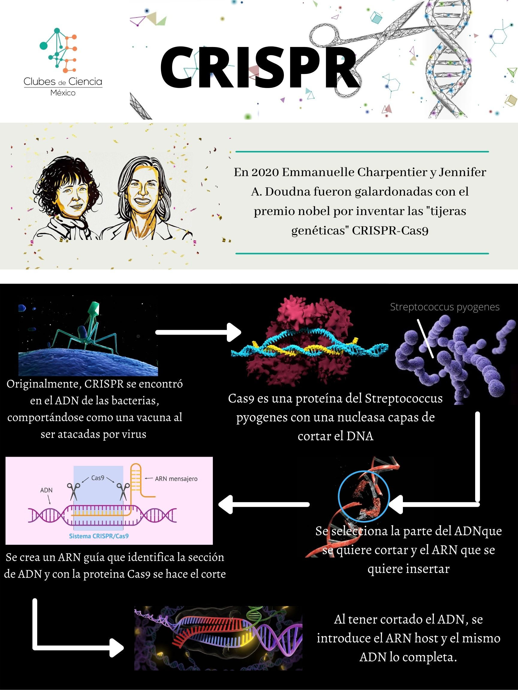

## CRISPR-Cas vs la resistencia a antimicrobianos… ¿Quién ganará?

Puede utilizar el [editor en GitHub](https://github.com/CdeCMx-org/templates_paginaweb/edit/main/README.md) para mantener y obtener una vista previa del contenido de su sitio web en archivos Markdown. Siempre que guardes los cambios en este repositorio, GitHub Pages ejecutará [Jekyll](https://jekyllrb.com/) para reconstruir las páginas de su sitio, a partir del contenido de sus archivos Markdown. Puedes escoger otro template en la siguiente página [repository settings](https://github.com/CdeCMx-org/templates_paginaweb/settings/pages). El tema de este template fue guardado en `_config.yml`.

El URL generado de tu página lo puedes encontrar en Settings -> Pages. 

*Puedes ver los cambios reflejados en la página, solo toma en cuenta que puede tomar unos minutos en cambiar.*

### Introducción

#### César
Cuántas veces no hemos tomado un antibiótico para aquella gripe, infección estomacal o alguna otra enfermedad producida por bacterias, creyendo que estas morirían, algunos de ellos mueren destruyendo la enfermedad. Sin embargo, algunas bacterias logran sobrevivir a dicho antibiótico y no solo eso, logran incorporar genes de resistencia a dicho antibiótico en su genoma y, con ello, logran evolucionar para adaptarse a tal peligro.

La realidad es que este es un problema bastante importante hoy en día; El surgimiento de bacterias resistentes a antibióticos ha hecho muy complicado el combatir enfermedades infecciosas y el desarrollo de nuevos antibióticos. Este problema no solo es culpa del uso terapéutico irresponsable de antibióticos; Incluso en la agricultura se han utilizado desmedidamente algunos antibióticos, generando resistencia como consecuencia.

Se han utilizado diversas formas de tratar bacterias resistentes, una de las más modernas consiste en el empleo de la tecnología de sistemas CRISPR-Cas, las cuales son herramientas dirigidas al knock-in y knock-out de secuencias específicas de ADN relacionadas con la resistencia a antibióticos, esto con ayuda de una endonucleasa dirigida por una secuencia de ADN guía que corta el ADN conocida como enzima Cas (usualmente Cas9). Esta herramienta es de gran interés, por lo que una revisión de este método de control de bacterias resistentes a antimicrobianos es pertinente. 

#### Itza
¿Cuántas veces no hemos tomado un antibiótico para aquella gripe, infección estomacal o alguna otra enfermedad producida por bacterias?, creyendo que estas morirían… y si bien algunas de ellas mueren destruyendo la enfermedad hay otras que son resistentes, y es aquí cuando somos los campos de batalla de una guerra en nuestro sistema, ya que existen bacterias que son resistentes a los antibióticos y que son capaces de seguir multiplicándose aún con la presencia de ellos. Esta es una de las amenazas a nivel mundial más grandes a la que nos enfrentamos hoy en día, y es por ello que es de suma importancia buscar nuevas herramientas que adopten mecanismos bactericidas evitando la resistencia de las mismas, una de ellas la famosa técnica CRISPR_Cas9, la cual fue la acreedora al Premio Nobel de Química 2020 y la cual entre sus múltiples aplicaciones actualmente se enfrenta a la dura tarea de frenar la aparición de resistencia a antimicrobianos... ¿lo logrará?

Describe de qué trata tu proyecto:
* ¿qué problema vas a abordar?
* ¿porqué es importante?
* ¿cómo se relaciona con la **ODS** asignada a tu club? 
* ¿cómo se relaciona lo aprendido en tu club para resolver el problema que planteaste?

### Métodología

Con base en la pregunta de investigación planteada, nos pusimos a indagar en artículos de investigación, vídeos, revistas científicas y todo aquel material que nos pudiera servir de ayuda para conocer más acerca de esta técnica tan innovadora.

Describe los pasos específicos que tomaste para realizar tu proyecto. Trata de hacer una descripción concreta y detallada. Si aplica, puedes incluir un diagrama describiendo el procedimiento. 

### Resultados

Si bien aún es un sueño que esta técnica pueda usarse de manera efectiva y eficaz en contra de la resistencia antimicrobiana, se han hecho avances a pasos agigantados, lo que nos da la esperanza de que, en un futuro no muy lejano, este sueño se convierta en una realidad y que pronto podamos tener una alternativa mucho más innovadora y eficiente para combatir la resistencia que presentan estos enemigos (naturales o no) para con nuestro cuerpo.

Este es el momento en que nos compartas los resultados obtenidos en tu proyecto. Asegurate de incluir material visual (gráficas, fotos, diagramas, tablas). 

Puedes insertar imagenes utilizando Markdown ``.

O utilizando codigo html ``, la ventaja de utilizar html es que le puedes modificar el tamaño utilizando **width**.

### Conclusiones

Esta técnica además se ha comenzado a trabajar en conjunto con las nanopartículas con el fin de dirigir los medicamentos hacia una célula o un conjunto de ellas en específico, que si bien aún se sigue perfeccionando, no cabe duda que esta técnica llegó para revolucionar la historia y los horizontes que conocíamos sobre la medicina, ¡aún hay un mundo de posibilidades por explorar! ¿y tú… por quién apuestas?

Comparte tus observaciones, lo aprendedido, limitaciones y siguientes pasos. 

### Video
 1. Para insertar un video de YouTube, en la página de YouTube del video selecciona compartir y selecciona el código de html.
 
<iframe width="560" height="315" src="https://www.youtube.com/embed/lnGfKjVO3FU" title="YouTube video player" frameborder="0" allow="accelerometer; autoplay; clipboard-write; encrypted-media; gyroscope; picture-in-picture" allowfullscreen></iframe>
 
 2. Insertar el link de tu video en YouTube, [nuestro video](https://youtu.be/rmXvlBPq24Q).
 4. Puedes subir el archivo de tu video directamente a Github [instrucciones aquí](https://stackoverflow.com/questions/4279611/how-to-embed-a-video-into-github-readme-md)

 
### Equipo
Equipo 2:
* Andrea Alemán
* César Güémez
* Mariana Rodríguez
* Itzahiana Solis
